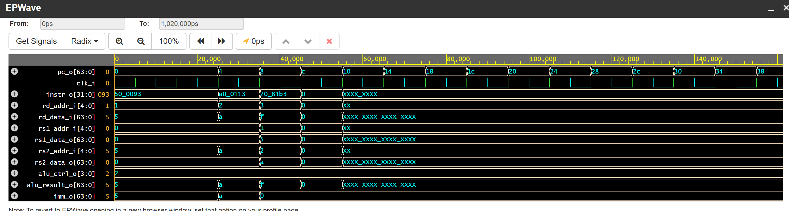
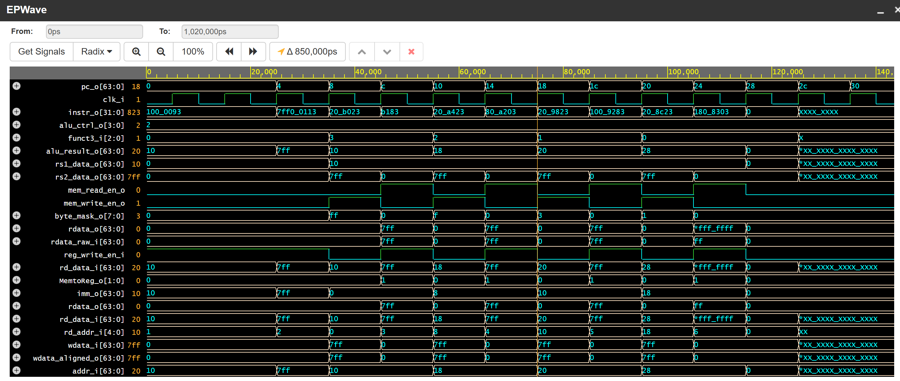
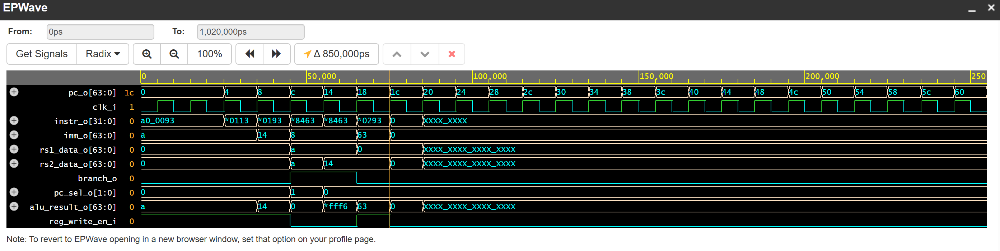
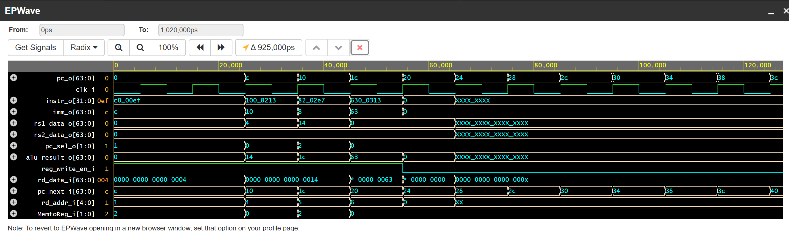

# RISC-V-SINGLE-DATAPATH
Designing RISC_V core processor RV64I Single Cycle by System Verilog
## 1. Giới thiệu chung (Introduction to Datapath)
File này tập trung thiết kế và mô phỏng lõi vi xử lý **RISC-V 64-bit (RV64I)** dựa trên kiến trúc **Single-Cycle** (đơn chu kỳ) sử dụng ngôn ngữ mô tả phần cứng SystemVerilog. Thiết kế tuân thủ tập lệnh cơ sở (Base Integer Instruction Set) của RISC-V, tối ưu hóa quá trình xử lý luồng dữ liệu (datapath) để hoàn tất một lệnh trong một chu kỳ xung nhịp duy nhất.
Kiến trúc cốt lõi được chia thành 5 giai đoạn (stages) xử lý liền mạch:
1. **Instruction Fetch (IF):** Khối `ProgramCounter` cập nhật địa chỉ và trích xuất mã lệnh 32-bit từ bộ nhớ lệnh `IMEM`.
2. **Instruction Decode (ID):** Khối `ControlUnit` giải mã lệnh và thiết lập các cờ tín hiệu điều khiển. Cùng lúc đó, khối `ImmGen` trích xuất hằng số tức thời, và các toán hạng được đọc ra từ tập thanh ghi `RegFile`.
3. **Execute (EX):** Khối `ALU_64bit` đảm nhiệm các phép toán số học (ADD, SUB), logic (AND, OR, XOR) và dịch bit (SLL, SRL, SRA). Song song đó, khối `PC_adder` tính toán sẵn địa chỉ đích cho các lệnh rẽ nhánh.
4. **Memory Access (MEM):** Giao tiếp với bộ nhớ dữ liệu `Dmem`. Bộ Load/Store Unit (`LSU`) đặc biệt được tích hợp để xử lý việc căn chỉnh (alignment) và mở rộng bit (sign/zero extension) chính xác cho đa dạng kích thước dữ liệu (Byte, Half-word, Word, Double-word).
5. **Write Back (WB):** Hệ thống bộ ghép kênh (như `Mux_MemtoReg`) đóng vai trò định tuyến, lựa chọn luồng dữ liệu cuối cùng từ ALU hoặc Dmem để ghi ngược cấu hình trở lại `RegFile`.
6. **Memory-Mapped I/O (MMIO):** Hệ thống được tích hợp khối giải mã địa chỉ (`Address_Decoder`) để giao tiếp trực tiếp với các thiết bị ngoại vi bên ngoài. Các ngoại vi 32-bit bao gồm ngõ vào (`switch_i`) và ngõ ra hiển thị (`red_led_o`, `green_led_o`) được ánh xạ trực tiếp vào không gian bộ nhớ. Thiết kế này cho phép CPU điều khiển phần cứng linh hoạt chỉ bằng các lệnh Load/Store tiêu chuẩn, đồng thời áp dụng kỹ thuật chèn bit (Zero-Extension) để ép kiểu tương thích giữa bus 64-bit của lõi và vi mạch 32-bit.
<p align="center">
  
</p>
<p align="center">
  <em>Hình 1: Sơ đồ nguyên lý Datapath kiến trúc RV64I Single-Cycle</em>
</p>

## 2. Kiểm Thử (Testbench and Verfication)

Quá trình kiểm tra tính đúng đắn của Datapath được thực hiện bằng cách nạp mã máy (machine code) biên dịch từ tập lệnh Assembly vào bộ nhớ `IMEM`, sau đó quan sát sự biến đổi của các tín hiệu điều khiển và luồng dữ liệu trên đồ thị sóng (Waveform).

### 2.1. Test Lệnh Số Học (ADD / SUB)

**Mục tiêu:** Xác minh luồng dữ liệu đi từ tập thanh ghi (`RegFile`) và khối `ImmGen32_64`, xuyên qua khối tính toán (`ALU_64bit`) và ghi ngược kết quả chính xác về lại thanh ghi đích.

**Đoạn mã Assembly được nạp (Minh họa phép tính 5 + 10 = 15):**
```assembly
addi x1, x0, 5      // Cycle 1: x1 = 0 + 5 = 5
addi x2, x0, 10     // Cycle 2: x2 = 0 + 10 = 10
add  x3, x1, x2     // Cycle 3: x3 = x1 + x2 = 15
```
**Các tín hiệu trọng tâm cần quan sát:**
* **`clk_i` & `pc_o`:** Xung nhịp hệ thống và Bộ đếm chương trình.
* **`instr_o`:** Mã lệnh đang được thực thi.
* **`rs1_data_o` & `rs2_data_o`:** Dữ liệu trích xuất từ 2 thanh ghi nguồn.
* **`alu_ctrl_o`:** Mã điều khiển khối tính toán ALU.
* **`alu_result_o`:** Kết quả trả về từ phép toán.
* **`rd_data_i`:** Luồng dữ liệu cuối cùng chốt về thanh ghi đích (Write-back).

**Phân tích kết quả trên Waveform (Định dạng Hexadecimal):**

<p align="center">
  
</p>
<p align="center">
  <em>Hình 2: Trạng thái các tín hiệu nội bộ khi CPU thực thi chuỗi lệnh ADD (Hệ cơ số 16)</em>
</p>

* **Chu kỳ 1 (`pc_o = 0x0`):** Lệnh `ADDI` đầu tiên được trích xuất. Mã điều khiển ALU chỉ định phép cộng (`alu_ctrl_o = 0x2`). Ngõ ra ALU tính toán thành công giá trị `alu_result_o = 0x5` và truyền thẳng tới dây `rd_data_i = 0x5` để ghi chốt vào thanh ghi `x1`.
* **Chu kỳ 2 (`pc_o = 0x4`):** Lệnh `ADDI` thứ hai thực thi tương tự chu kỳ trước. Giá trị tức thời `0xa` (tương đương 10) đi qua ALU, cho ra kết quả `alu_result_o = 0xa` và tiếp tục được định tuyến về `rd_data_i = 0xa` để cập nhật cho thanh ghi `x2`.
* **Chu kỳ 3 (`pc_o = 0x8`):** Lệnh `ADD` chính thức được kích hoạt. Các dây dữ liệu nguồn xuất chính xác giá trị đã lưu ở 2 chu kỳ trước: `rs1_data_o = 0x5` và `rs2_data_o = 0xa`. Dưới tín hiệu điều khiển `alu_ctrl_o = 0x2`, khối ALU thực hiện cộng hai toán hạng, trả về kết quả chính xác `alu_result_o = 0xf` (tức 15). Giá trị này thành công đi vào `rd_data_i` để ghi ngược về thanh ghi đích `x3`.

### 2.2. Test Truy Cập Bộ Nhớ Đa Kích Thước (Load / Store)

**Mục tiêu:** Kiểm tra khả năng ghi/đọc dữ liệu từ `Dmem` thông qua khối Load/Store Unit (`LSU`). Đặc biệt xác minh khả năng cắt bit (masking) khi Store và mở rộng dấu (sign-extension) khi Load đối với các kích thước dữ liệu: Double-word (64-bit), Word (32-bit), Half-word (16-bit) và Byte (8-bit).

**Đoạn mã Assembly được nạp (Kiểm tra cắt bit và mở rộng dấu):**
```assembly
// Nạp địa chỉ nền và dữ liệu test
addi x1, x0, 16           // x1 = 0x10 (Địa chỉ nền)
addi x2, x0, 2047         // x2 = 0x7FF (Nhị phân: 0000...0111 1111 1111)

// 1. Test Double-word (64-bit)
sd   x2, 0(x1)            // Ghi 0x7FF vào Dmem[0x10]
ld   x3, 0(x1)            // Đọc lại vào x3 (Kết quả: 0x7FF)

// 2. Test Word (32-bit)
sw   x2, 8(x1)            // Ghi 32-bit dưới vào Dmem[0x18]
lw   x4, 8(x1)            // Đọc 32-bit, mở rộng dấu vào x4 (Kết quả: 0x7FF)

// 3. Test Half-word (16-bit)
sh   x2, 16(x1)           // Ghi 16-bit dưới (0x07FF) vào Dmem[0x20]
lh   x5, 16(x1)           // Đọc 16-bit, mở rộng dấu vào x5 (Kết quả: 0x7FF)

// 4. Test Byte (8-bit) - Trường hợp đặc biệt để kiểm tra Sign-Extension
sb   x2, 24(x1)           // Cắt lấy 8-bit thấp nhất (0xFF) ghi vào Dmem[0x28]
lb   x6, 24(x1)           // Đọc 8-bit (0xFF). Do bit MSB = 1, Load Byte sẽ mở rộng dấu
                          // Kết quả x6 bắt buộc phải là: 0xFFFFFFFFFFFFFFFF
```

**Phân tích kết quả trên Waveform (Định dạng Hexadecimal):**

<p align="center">
  
</p>
<p align="center">
  <em>Hình 3: Quá trình xử lý mặt nạ bit và mở rộng dấu của khối LSU qua các lệnh Load/Store</em>
</p>

* **Chu kỳ Khởi tạo (`pc_o = 0x0` và `0x4`):**
  Hai lệnh `ADDI` đầu tiên được thực thi trơn tru để nạp giá trị ban đầu. Thanh ghi `x1` nhận địa chỉ nền `0x10`, thanh ghi `x2` nhận dữ liệu mẫu `0x7ff` để chuẩn bị cho các bài test.

* **Test Truy cập 64-bit (`pc_o = 0x8` và `0xc`):**
  * **`pc_o = 0x8` (Lệnh `SD`):** ALU cộng `rs1` và `imm` ra địa chỉ RAM `alu_result_o = 0x10`. Dựa vào `funct3=3` nên khối LSU sinh mặt nạ `byte_mask_o = 0xff` (bật 8 byte) và bật cờ `mem_write_en_o = 1`. Toàn bộ dữ liệu `0x7ff` được ghi vào Dmem.
  * **`pc_o = 0xc` (Lệnh `LD`):** Đọc lại dữ liệu từ địa chỉ `0x10` để lấy dữ liệu `0x7ff` đã lưu ra. Cờ `MemtoReg_o = 1` định tuyến dữ liệu từ Dmem về thanh ghi. Kết quả `rd_data_i = 0x7ff` và tại địa chỉ `rd_addr_i[4:0]=3` tức là thanh ghi 3.

* **Test Truy cập 32-bit (`pc_o = 0x10` và `0x14`):**
  * **`pc_o = 0x10` (Lệnh `SW`):** Địa chỉ ghi là `0x18`. Dựa vào `funct3 = 2`, mặt nạ chỉ bật 4 byte thấp: `byte_mask_o = 0xFF`. Dữ liệu gốc 64 bit `0x00000000000007ff` chỉ được lưu 32 bit thấp nhất là `0x000007FF` và số 0 không được hiển thị trên waveform
  * **`pc_o = 0x14` (Lệnh `LW`):** Đọc từ địa chỉ `0x18`. Mặc dù là lệnh đọc Word (32-bit), do dữ liệu `0x7ff` là số dương, LSU tự động thực hiện Zero-Extension (mở rộng 0), trả về `rd_data_i = 0x7ff` chuẩn xác.

* **Test Truy cập 16-bit (`pc_o = 0x18` và `0x1c`):**
  * **`pc_o = 0x18` (Lệnh `SH`):** Địa chỉ ghi tiến lên `0x20`. Dựa vào `funct3=1` Khối LSU sinh mặt nạ bật 2 byte thấp: `byte_mask_o = 0x3`. Dữ liệu gốc 64 bit `0x00000000000007FF` chỉ lưu được 16 bit thấp nhất là `0x07FF`
  * **`pc_o = 0x1c` (Lệnh `LH`):** Đọc thành công từ `0x20` và trả về `rd_data_i = 0x7ff` (số 0 ở trước được lược bỏ).

* **Test Truy cập 8-bit & Tính năng Sign-Extension (`pc_o = 0x20` và `0x24`):**
  * **`pc_o = 0x20` (Lệnh `SB`):** Lệnh ghi Byte tại địa chỉ `0x28`. Mặt nạ thu hẹp chỉ còn 1 byte thấp nhất: `byte_mask_o = 0x1`. Khối LSU đã cắt trích xuất lấy đúng 8 bit cuối của `0x7ff`, tức là `0xff` để đẩy vào bộ nhớ.
  * **`pc_o = 0x24` (Lệnh `LB`):** Đây là chu kỳ chứng minh mạch Datapath hoàn thiện. Lõi đọc lên dữ liệu thô `rdata_raw_i = 0xff`. Dựa vào `funct3 = 0` (Byte) và nhận diện được bit MSB của `0xff` là `1` (bit dấu âm), khối LSU ngay lập tức kích hoạt tính năng **Sign-Extension** (Mở rộng dấu). Nó lấp đầy phần tử cao bằng bit `1`, đẩy về thanh ghi kết quả `rd_data_i = 0xffffffffffffffff`.

### 2.3. Test Lệnh Rẽ Nhánh Có Điều Kiện (BEQ)

**Mục tiêu:** Kiểm tra hoạt động của khối so sánh nhánh và khả năng cập nhật Bộ đếm chương trình (`PC`) đối với lệnh `BEQ` (Branch if Equal). Đảm bảo Datapath xử lý chuẩn xác 2 trường hợp:
1. **Branch Taken:** Điều kiện bằng nhau thỏa mãn, PC nhảy tới địa chỉ đích (`PC + imm`).
2. **Branch Not Taken:** Điều kiện không thỏa mãn, PC bỏ qua phép nhảy và đi tiếp (`PC + 4`).

**Các tín hiệu trọng tâm cần quan sát:**
* **`pc_o`:** Quan sát bước nhảy của con trỏ lệnh.
* **`rs1_data_o` & `rs2_data_o`:** Hai toán hạng mang vào so sánh.
* **`pc_sel_o`:** Cờ điều khiển bộ ghép kênh chọn nguồn PC (Bằng `1` khi nhảy, bằng `0` khi đi tiếp).

**Đoạn mã Assembly được nạp:**
```assembly
// Nạp dữ liệu test
addi x1, x0, 10      // pc=0x0 : x1 = 10
addi x2, x0, 10      // pc=0x4 : x2 = 10
addi x3, x0, 20      // pc=0x8 : x3 = 20

// 1. Test BEQ Taken (Điều kiện ĐÚNG -> Phải nhảy)
beq  x1, x2, 8       // pc=0xc : Vì x1 == x2 (10 == 10) -> Nhảy tới pc = 0xc + 8 = 0x14
addi x4, x0, -1      // pc=0x10: Lệnh này BỊ BỎ QUA (x4 giữ nguyên = 0)

// 2. Test BEQ Not Taken (Điều kiện SAI -> Không nhảy)
beq  x1, x3, 8       // pc=0x14: Vì x1 == x3 là SAI (10 != 20) -> Không nhảy, đi tiếp
addi x5, x0, 99      // pc=0x18: Lệnh này ĐƯỢC THỰC THI (x5 = 99)
```

**Phân tích kết quả trên Waveform (Định dạng Hexadecimal):**

<p align="center">
  
</p>
<p align="center">
  <em>Lệnh branch if equal </em>
</p>

**Phân tích kết quả trên Waveform (Định dạng Hexadecimal):**

* **Khởi tạo dữ liệu (`pc_o` từ `0x0` đến `0x8`):** 
  Lõi nạp thành công các giá trị kiểm thử vào thanh ghi. Trên đồ thị, ta thấy `rs1_data_o` và `rs2_data_o` đã xuất hiện các giá trị `0xa` (10) và `0x14` (20) để chuẩn bị cho quá trình so sánh.

* **Trường hợp Branch Taken (`pc_o = 0xc`):**
  Lệnh `BEQ` đối chiếu hai toán hạng `rs1_data_o = 0xa` và `rs2_data_o = 0xa`. Khối điều khiển nhận thấy cờ `branch_o = 1` và hai giá trị hoàn toàn trùng khớp nên kích hoạt cờ chọn nhánh **`pc_sel_o = 1`**. Ngay tại cạnh lên xung nhịp tiếp theo, con trỏ lệnh `pc_o` **nhảy cóc thành công từ `0xc` sang `0x14`**, lách qua hoàn toàn lệnh bẫy ở địa chỉ `0x10`.

* **Trường hợp Branch Not Taken (`pc_o = 0x14`):**
  Lệnh `BEQ` thứ hai tiến hành đối chiếu `rs1_data_o = 0xa` và `rs2_data_o = 0x14`. Vì hai giá trị này khác nhau, điều kiện nhảy không thỏa mãn. Khối điều khiển giữ nguyên cờ **`pc_sel_o = 0`**. Lệnh nhảy bị hủy, CPU đi thẳng xuống `pc_o = 0x18`.

* **Hoàn tất kiểm thử (`pc_o = 0x18`):**
  CPU thực thi thành công lệnh cộng `ADDI` ngay sau đó, xuất ra kết quả `alu_result_o = 0x63` (99 thập phân) và đồng thời bật cờ `reg_write_en_i = 1` để lưu chính xác giá trị này về Register File.

  ### 2.4. Test Lệnh Bước Nhảy Vô Điều Kiện (JAL và JALR)

**Mục tiêu:** Kiểm tra khả năng nhảy cóc của Bộ đếm chương trình (`PC`) và tính năng "Link" (lưu địa chỉ quay về) của hai lệnh nhảy vô điều kiện. 
* **`JAL` (J-Type):** Nhảy tới địa chỉ tương đối `PC + imm`.
* **`JALR` (I-Type):** Nhảy tới địa chỉ tuyệt đối `rs1 + imm`.
* Đặc điểm chung bắt buộc: Cả hai lệnh đều phải ghi giá trị `PC + 4` (địa chỉ của lệnh kế tiếp) vào thanh ghi đích `rd`.

**Đoạn mã Assembly được nạp:**
```assembly
// 1. Test lệnh JAL
jal  x1, 12       // pc=0x0 : Nhảy tới 0x0 + 12 = 0xc. Lưu x1 = 0x4
addi x0, x0, -1   // pc=0x4 : BẪY (Sẽ bị lướt qua)
addi x0, x0, -1   // pc=0x8 : BẪY (Sẽ bị lướt qua)

// 2. Chuẩn bị địa chỉ nền cho JALR
addi x4, x1, 16   // pc=0xc : x4 = 4 + 16 = 20 (0x14)

// 3. Test lệnh JALR
jalr x5, x4, 8    // pc=0x10: Nhảy tới x4 + 8 = 0x14 + 8 = 0x1c. Lưu x5 = 0x14
addi x0, x0, -1   // pc=0x14: BẪY 
addi x0, x0, -1   // pc=0x18: BẪY 

// 4. Đích đến cuối cùng
addi x6, x0, 99   // pc=0x1c: Lệnh ĐƯỢC THỰC THI (x6 = 0x63)
```
**Phân tích kết quả trên Waveform (Định dạng Hexadecimal):**

<p align="center">
  
</p>
<p align="center">
  <em>Lệnh JAL và JALR </em>
</p>

**Phân tích kết quả trên Waveform (Định dạng Hexadecimal):**

* **Thực thi lệnh JAL (pc_o = 0x0)**:
  Lệnh JAL được giải mã thành công. Khối điều khiển bật cờ định tuyến `pc_sel_o = 2'b01 (1 trong hex)`. Cùng lúc đó, cờ cho phép ghi thanh ghi `reg_write_en_i` được kéo lên 1, chốt chính xác địa chỉ quay về `rd_data_i = 0x4 (PC + 4)` vào thanh ghi x1. Ở cạnh xung nhịp tiếp theo,`pc_o` nhảy cóc an toàn từ `0x0` sang đích đến `0xc`. Vì đã trỏ tới địa chỉ `0xc` nên 2 dòng lệnh tiếp theo bị nhảy qua do địa chỉ không trùng với địa chỉ của `pc_o` hiện tại.
* **Chuẩn bị địa chỉ nền (`pc_o = 0xc`):
  Lệnh ADDI thực hiện cộng giá trị `0x4` (vừa được JAL lưu lại) với `0x10` (16 thập phân), xuất ra kết quả `alu_result_o = 0x14`. Giá trị này được ghi vào thanh ghi x4 để làm địa chỉ nền cho lệnh nhảy tiếp theo.
* **Thực thi lệnh JALR**:
  Lệnh JALR sử dụng địa chỉ nền `rs1_data_o = 0x14` cộng với độ lệch `imm_o = 0x8` để tạo ra địa chỉ đích 0x1c tại ngõ ra ALU. Khối điều khiển nhận diện đúng tập lệnh và xuất mã `pc_sel_o = 2` để định tuyến tín hiệu này về PC. Tương tự JAL, cờ `reg_write_en_i` tiếp tục nảy lên 1 để chốt địa chỉ quay về `rd_data_i = 0x14 (PC + 4)` vào thanh ghi `x5`. Ở cạnh xung nhịp kế, `pc_o` vọt thẳng tới `0x1c`.
* **Điểm đến cuối cùng**:
  Lõi thực thi thành công lệnh ADDI cuối cùng, vượt qua toàn bộ các lệnh bẫy được giăng sẵn. Giá trị 0x63 (99 thập phân) được tính toán và chốt an toàn về thanh ghi.
